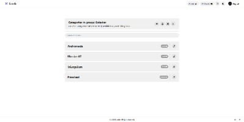
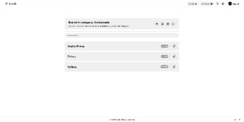
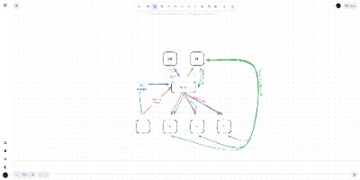
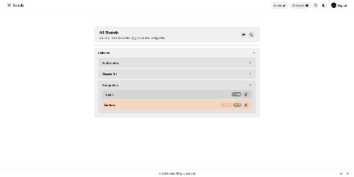
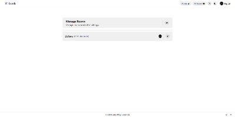
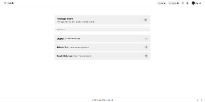

# 📝 Boards App (Frontend)

**Boards App** is a collaborative whiteboard interface built with [Excalidraw](https://github.com/excalidraw/excalidraw). It integrates real-time collaboration, group-based board management, persistent storage, and OAuth login—all backed by the Boards Room backend.

---

## 🚀 Features

- 🧠 Real-time multi-user drawing (Excalidraw)
- 📁 Organization hierarchy: Groups > Categories > Boards > Live Rooms
- 🔐 Admin panel to manage live rooms and users
- 🗝️ Fine-grained user access control (read/write permissions)
- 🙈 Option to hide collaborators if preferred
- 🌗 Dark and light mode themes
- 🔒 OAuth login (GitHub, Google, Microsoft, Discord)
- ☁️ S3-based file storage
- 🗃️ PostgreSQL for persistent board and user data

---

## 🖼️ Screenshots

Here are some screenshots showcasing the app interface and key features:

| Group View                                | Category View                                   | Board View                                |
| ----------------------------------------- | ----------------------------------------------- | ------------------------------------------ |
| [](screenshots/group_view.png) | [](screenshots/category_view.png) | [](screenshots/board_view.png) |

| All-in-One View                       | Admin: Rooms                                | Admin: Users                                |
| ------------------------------------- | ------------------------------------------- | ------------------------------------------- |
| [](screenshots/all_view.png) | [](screenshots/admin_rooms.png) | [](screenshots/admin_users.png) |

---

## ⚙️ Getting Started

### 1. Clone the repo

```bash
git clone https://github.com/Excali-Boards/boards-app.git
cd boards-app
pnpm install
```

### 2. Configure environment

Create a `.env` file with the following variables:

```env
# Core URLs
BASE_URL="http://localhost:3002"
API_URL="http://localhost:3004"

# Server Configuration
PORT=3002
SESSION_SECRET="your-session-secret"
API_TOKEN="your-api-token"           # Must match backend token

# S3 Configuration
S3_URL="https://your-s3-url"
S3_BUCKET="your-s3-bucket"

# Google OAuth
USE_GOOGLE=true
GOOGLE_CLIENT_ID=""
GOOGLE_CLIENT_SECRET=""
GOOGLE_REDIRECT_URI="http://localhost:3002/callback/google"

# GitHub OAuth
USE_GITHUB=true
GITHUB_CLIENT_ID=""
GITHUB_CLIENT_SECRET=""
GITHUB_REDIRECT_URI="http://localhost:3002/callback/github"

# Discord OAuth
USE_DISCORD=false
DISCORD_CLIENT_ID=""
DISCORD_CLIENT_SECRET=""
DISCORD_REDIRECT_URI="http://localhost:3002/callback/discord"

# Microsoft OAuth
USE_MICROSOFT=false
MICROSOFT_CLIENT_ID=""
MICROSOFT_CLIENT_SECRET=""
MICROSOFT_TENANT_ID=""
MICROSOFT_REDIRECT_URI="http://localhost:3002/callback/microsoft"
```

> 📌 Refer to [`remix-auth`](https://github.com/sergiodxa/remix-auth) and provider-specific plugins for setup instructions.

### 3. Run the frontend

```bash
pnpm run rebuild
```

Frontend runs at `http://localhost:3002`.

---

## 📜 License

[GNU General Public License v3.0](./LICENSE)